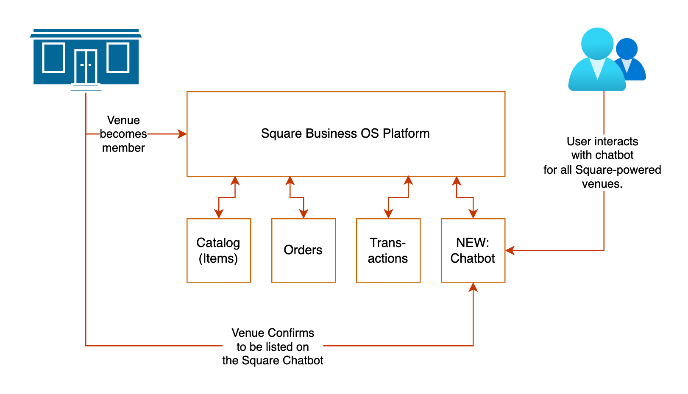
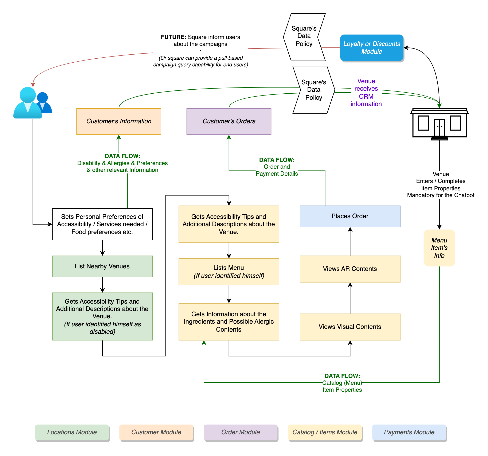

# All Square (5Quare)

- [All Square (5Quare)](#all-square-5quare)
- [Idea](#idea)
  - [Benefits to Venues](#benefits-to-venues)
  - [Benefits to End Users (Customers of the Venues)](#benefits-to-end-users-customers-of-the-venues)
- [How to Run?](#how-to-run)
- [How to Deploy?](#how-to-deploy)
- [Suggestions to Square](#suggestions-to-square)


This is a project for Square Hackathon.

Square is more than a payment provider, they're positioning themself as businesses' operating system. Square provides online sales channels, in-app payment solutions, staff management and more.

# Idea

Square generally develops B2B solutions. With this project we wished to touch with a B2C solution to Square's direct and indirect customers. Business powered by Square, can create an online presence. So businesses can join to a chatbot (the 5Quare) developed and managed by Square.

## Benefits to Venues

Square can offer a centralized chatbot to end-users, who can interact with the official Square channel, which lists all nearby Square-powered venues.



Businesses can get some benefits through this chatbot as below;


1. > **Better discoverability** by being listed in chatbot
1. > Providing **menu from a centralized place.** (Instead of maintaining another app for QR-menus.)
1. > Offering a **new and accessible way** of placing orders through chatbot interface
1. > Reach to a **bigger customer base,** by removing the need of installing an app for the user.
1. > Reaching to **customer data,** which makes easy to contact them and offer discounts, loyalty program. In summary: more reasons to revisit the venue.


Chatbot designed by following the user flow diagram below. Chatbot send/receive data to the 5 modules on Square platform.



We also tried to find a way to notify user about a discount offer by venue, with supported webhooks. _(Shown as FUTURE in diagram)_

But all the methods we found required workarounds which won't be generally appliable for the venues on Square platform. So these kind of services might be a development idea for Square team.

## Benefits to End Users (Customers of the Venues)

1. > No new app installed
1. > Quick interaction
1. > Menus share a common standard, in terms of accessibility
1. > Only menu solution which notifies users about the type of diet or allergies.
1. > Viewing menu items with AR
1. > Simply placing orders (even before visiting the venue)
1. > Simply paying orders, with registered payment information (Not Completely Implemented, for the reason, overview the [Suggestions to Square](#suggestions-to-square) )


---


# How to Run?

This bot is running on Telegram with [TheSquareBot](https://t.me/TheSquareBot) bot name.

You can interact with it. It uses Sandbox data.

Or you can deploy your own by following the title below, with a different Telegram Bot name.


# How to Deploy?

First create a virtual environment.

```Shell
python3 -m venv env
```

Create an environment file and insert credentials;
```Shell
touch .env
nano .env
```

Place these keys into the file;

```Dotenv
TOKEN=<Telegram Bot Token From @BotFather>
APPNAME=<Define Bot Name>
SQUARE_APP_ID_SANDBOX=<App Id>
SQUARE_TOKEN_SANDBOX=<Square Token>
PAYMENT_PROVIDER_TOKEN=<Token from Telegram Payment Module>
```

Telegram wraps Payment Provicer's token and provide another `PAYMENT_PROVIDER_TOKEN`. This token can be generated from Telegram's [BotFather](https://t.me/BotFather) bot. Telegram currently do not support Square's Payment System.

After creating the environment variables, activate the environment, install the requirement, and run the application.

```Shell
source env/bin/activate
pip3 install -r requirements.txt
python3 app.py
```

---

# Suggestions to Square

1. Providing **services to Telegram** as a payment provider, to streamline chatbot developments. *(Because Square is not compliant with Telegram, we cannot implemented native payment functionality. And collecting credit card info as a text message was not secure, so we just handled payments like cash payments.)*
1. **Displaying unpaid/unfulfilled orders** in Seller Dashboard, to abolish 3rd party order follow interfaces.  [Reference](https://developer.squareup.com/forums/t/order-not-showing-in-sandbox-dashboard-for-v2-orders/2407/2)
1. Adding a webhook support for **when a customer receive a discount** or an offer, by collecting points etc. from loyalty program, or by being defined by venue owner manually. So developers can develop a solution to notify customers (of the venue) as a push based communication strategy. Now, only pull based communications can be implemented, when customers perform an action.
